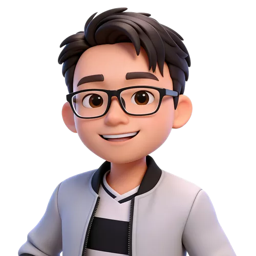

# Hi 👋, I'm Veen

你好呀，我是Veen! 你也可以叫我**阿卷**哦！

大模型善后工程师、🎓硕士、🤯技术理想主义，一个并没有太高物质欲望的人类🤖。在这个 Vibe Coding 盛行的时代，依然热爱古法编程。

Large Model Remediation Engineer, 🎓 Master’s degree holder, 🤯 a technical idealist—a human 🤖 with modest material desires. In this era where "Vibe Coding" reigns supreme, I remain devoted to the "old-school" way of programming.

##  Tech Stack

  

